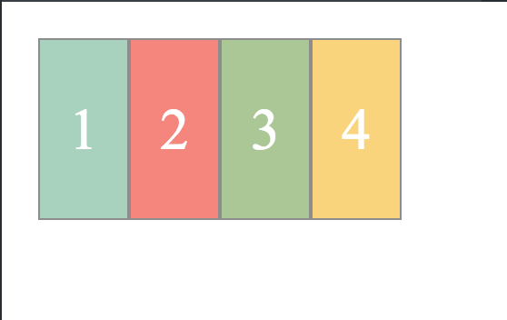
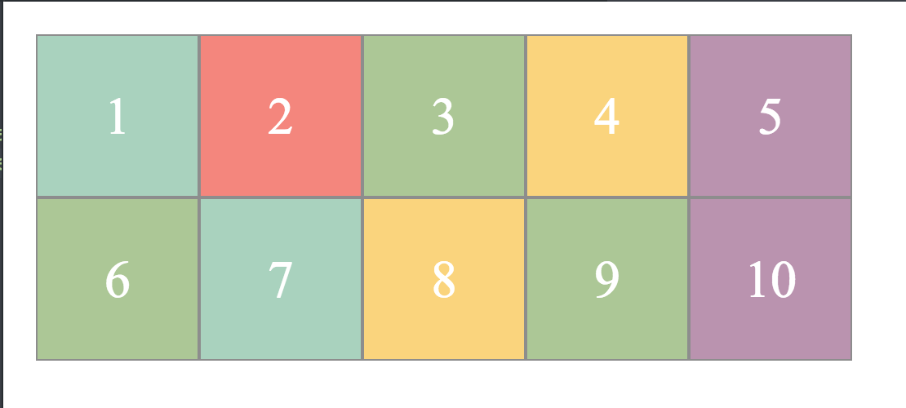
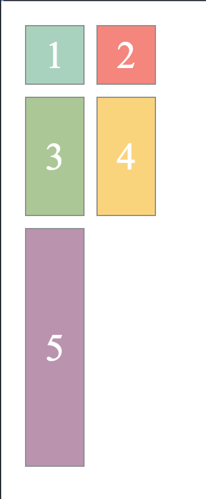

# Welcome to The Grid Games...

## The Goal
A new video gaming company has reached out to you and asked you to help them create some of the landscapes for their upcoming game. With your expert knowledge of CSS, you realize that this would be the perfect time to flex some of your CSS Grid muscles and give them the help they need to release the next big thing.


## The Lab

You'll be working through replicating each of the mockups below in different css files. You'll be given the HTML and some basic style (such as background color of divs), but it's up to you to transform a plain page of squares into the perfect backdrop for the company. The basic styling is contained in basic.css and once you've finished the lab you can check out the file to learn more about what's happening inside of it! For now, you can ignore the file as it isn't related to CSS Grid!

This [link](https://css-tricks.com/snippets/css/complete-guide-grid/) might be helpful as you work through the lab.

#### Level 1

For level one you'll be working in the level_one.css file to style the level_one.html file. For this first layout you'll want to focus on **grid-template-columns** and **grid-template-rows**. The end goal for this level is a simple row (with a height of 100px) with four columns (each with a width of 50px).



#### Level 2

One row of divs is great, but to make things more interesting for our player, we want to give them something that looks a little bit more like a board. For this, you'll be using the same properties that you worked with in the last level, but you'll want to create two rows, each with a width of 100px. Each row should have 5 columns in it, each with a width of 100px.



See if you can incorporate the use of the repeat keyword into this style! An example of how to use this has been included below.

```CSS
/* the following line of CSS would result in 10 rows width a height of 10 pixels! */
grid-template-rows: repeat(10, 10px)
```

<!-- maybe remove level 2 and move level 3 up? -->

#### Level 3

To make things a little bit more difficult for the player, you decide to make them have to jump from one square to the next. To do this you can use the **grid-gap** property to add spaces between your grid items. Combine the use of **grid-gap** with the properties you used above to create the grid below! Pay attention to how your grid styling handles an uneven number of divs!



<!-- Add in a level here about using the grid-template-area to make views that have a different number of columns in each row/use align and justify or maybe change level 3 to do this? make level 2 have different width rows? do we prefer grid-template area or using a regular grid with span properties? start/end?-->

#### Level 4

These grids have been looking awesome, but they're not very responsive to our page size. If you make your page larger or smaller, the grid stays the same... this would make it hard for our user to play these games on a phone and on a desktop. This is partially because we've been defining our widths and heights of columns in terms of pixels. Go into your level_four.css file and make each column 1 fraction of the width of the page. Your page should look similar to your first level but much more adaptive to page width.


This looks okay... but as you can see when your page gets really small the squares with single digit numbers become thinner than those with double digits. To avoid this, we can give all of our columns the same minimum width. Check out the **minmax** keyword and give all of your columns a minimum width of 50px and a maximum of 1fr.


Now our page is responsive, but still maintains the same look that we're trying to achieve.

#### Level 5

<!-- auto fit/ auto fill coupled with implicit rows -->
